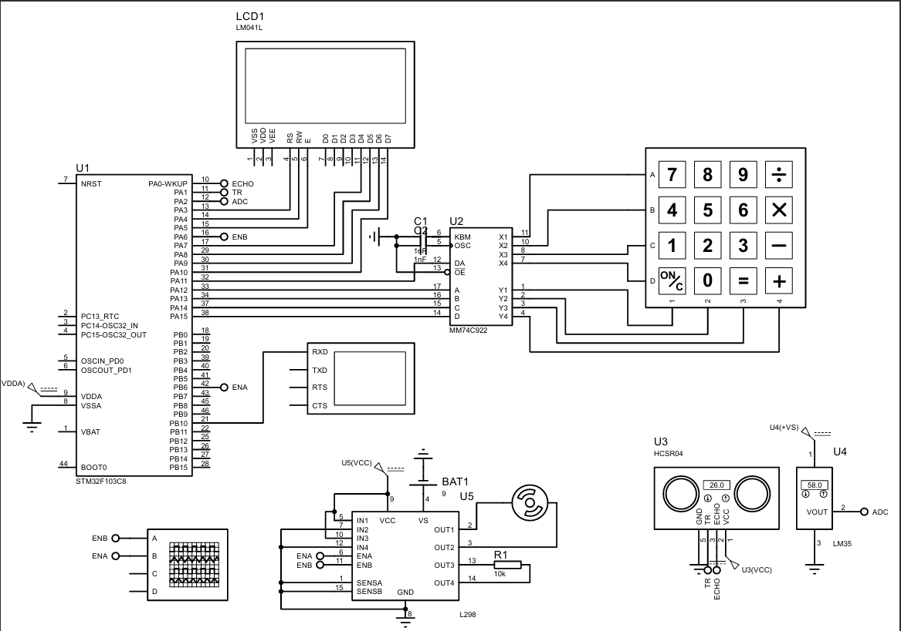
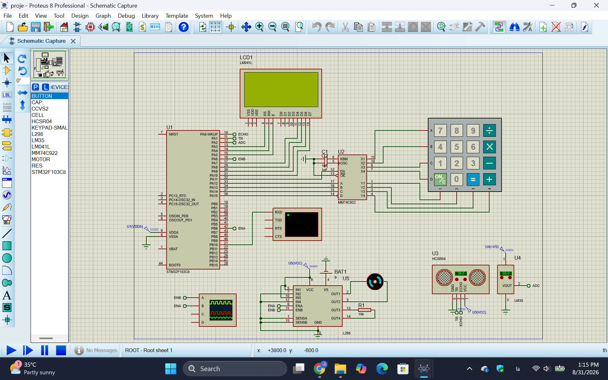

# STM32 Water Tank Control System

## Embedded Control System Based on STM32F103C8

This project presents a microcontroller-based water tank control system designed and simulated using STM32F103C8.

The system is capable of measuring water level, monitoring temperature, controlling a DC pump and heater using PWM signals, displaying system parameters on an LCD, and allowing the user to modify important parameters through a keypad-based menu.

The project was developed as an embedded systems course project and simulated in Proteus.

---

# Project Overview

The main goal of this project is to design an intelligent control system for a water tank.

The system performs:

- Water level measurement using an ultrasonic sensor
- Temperature measurement using an analog temperature sensor
- Pump speed control using PWM
- Heater power control using PWM
- LCD-based monitoring
- Keypad-based parameter adjustment
- RTC time management
- UART status communication

The complete circuit was designed and tested using Proteus simulation.

---

# Hardware Components

| Component | Function |
|---|---|
| STM32F103C8 | Main processing and control unit |
| HC-SR04 | Ultrasonic water level measurement |
| LM35 | Temperature measurement sensor |
| L298 | DC motor driver |
| LCD LM041L | Display system information |
| Keypad | User input and menu control |
| DC Motor | Water pump actuator |
| Heater Resistance | Temperature control actuator |

---

# System Architecture

```
                    +----------------+
                    |    HC-SR04     |
                    | Water Level    |
                    |    Sensor      |
                    +-------+--------+
                            |
                            |
                            v

                    +----------------+
                    |                |
                    | STM32F103C8    |
                    | Microcontroller|
                    |                |
                    +----------------+
                       |          |
                       |          |
              PWM      |          | ADC
                       |          |
                       v          v

              +-------------+   +-------------+
              |    L298     |   |    LM35     |
              | Motor Driver|   | Temperature |
              +-------------+   +-------------+
                       |
                       |
                       v

                  Water Pump


        Keypad  --------> STM32
        LCD     <-------- STM32
        UART    <-------- STM32
        RTC     <-------- STM32

```

---

# Circuit Diagram

The complete circuit schematic was designed in Proteus.

The design contains:

- STM32F103C8 controller
- LCD interface
- Keypad module
- HC-SR04 ultrasonic sensor
- LM35 temperature sensor
- L298 motor driver
- PWM-controlled actuators




---

# Proteus Simulation

The complete system was simulated using Proteus.

The simulation demonstrates:

- Real-time LCD monitoring
- Temperature measurement
- Water level measurement
- Motor control
- Keypad interaction
- UART communication




---

# Control System Description

## 1. Water Level Control

The HC-SR04 ultrasonic sensor is used to measure the distance between the sensor and the water surface.

The measurement process:

1. A trigger pulse is sent to the sensor.
2. The ultrasonic wave travels toward the water surface.
3. The reflected signal returns to the sensor.
4. The Echo pulse duration is measured using timer input capture.
5. The distance is calculated.

Distance calculation:

```
Distance = Difference / 61
```

The calculated distance is compared with the desired SetPoint.

The error value is used to generate a PWM signal for controlling the pump speed.

Control method:

```
Proportional Control
```

---

## 2. Temperature Control

The LM35 sensor provides an analog voltage proportional to temperature.

The STM32 ADC module reads the sensor output and converts it into a digital value.

The temperature is calculated and displayed on the LCD.

The heater power is controlled using PWM according to the temperature error.

Control method:

```
Proportional Control
```

System behavior:

- At low temperature:
  - PWM increases
  - Heater operates with higher power

- Near the desired temperature:
  - PWM decreases
  - Heater power is reduced

---

# User Interface Menu

A keypad-based menu was designed to allow the user to modify system parameters without changing the firmware.

Main menu:

```
1-SetPoint

2-Time
```

---

## SetPoint Adjustment

The user can enter a new water level reference value.

Process:

1. Select SetPoint option.
2. Enter a new value using keypad.
3. Validate the input range.
4. Store the new value.
5. Return to normal operation.

After successful update:

```
SetPoint changed successfully
```

is sent through UART.

---

## RTC Time Adjustment

The user can modify:

- Hour
- Minute
- Second


Validation:

```
Hour   < 24

Minute < 60

Second < 60
```

After successful update:

```
Time changed successfully
```

is transmitted through UART.

---

# Firmware Description

The firmware was developed in C language using STM32 HAL libraries.

Main implemented modules:

- ADC temperature measurement
- Timer Input Capture for HC-SR04
- PWM generation
- RTC management
- UART communication
- Keypad scanning
- LCD control


Firmware structure:

```
firmware/

├── main.c

└── proje.hex

```

---

# Software Operation Flow

```
Start

 |

Initialize STM32 peripherals

 |

Read sensors

 |

Calculate:

- Temperature
- Water level

 |

Display values on LCD

 |

Calculate control error

 |

Generate PWM

 |

Control Pump and Heater

 |

Check Keypad Input

 |

Update Parameters if Required

 |

Repeat

```

---

# Simulation Files

The Proteus simulation project is available in:

```
simulation/

└── proje.pdsprj

```

To run:

1. Open Proteus.
2. Load `proje.pdsprj`.
3. Start simulation.
4. Interact with keypad and observe LCD output.

---

# Project Documentation

Complete project report:

```
documentation/

└── project-report-fa.pdf

```

The documentation includes:

- Component introduction
- Circuit explanation
- Control algorithms
- Menu design
- Firmware description
- Simulation results

---

# Project Results

Implemented features:

| Feature | Status |
|---|---|
| Water level measurement | Completed |
| Temperature measurement | Completed |
| LCD monitoring | Completed |
| PWM pump control | Completed |
| PWM heater control | Completed |
| Keypad menu | Completed |
| RTC adjustment | Completed |
| UART messages | Completed |

---

# Repository Structure

```
STM32-Water-Tank-Control-System

│
├── README.md
│
├── documentation
│   ├── README.md
│   └── project-report-fa.pdf
│
├── firmware
│   ├── README.md
│   ├── main.c
│   └── proje.hex
│
├── images
│   ├── README.md
│   ├── circuit-overview.png
│   └── proteus.png
│
└── simulation
    ├── README.md
    └── proje.pdsprj

```

---

# Authors

- Arghavan Memari
- Erfan Faghihi
- Alireza Montajab


Academic Project  
Embedded Systems Course  
Academic Year: 1404-1405
